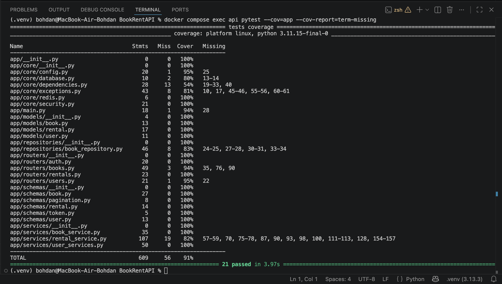

# BookRent API 📚

A high-performance, asynchronous REST API for managing a book catalog and user rentals. Built with modern Python backend standards, featuring a layered architecture, advanced caching, and secure authentication.

## ✨ Key Features

* **High Performance:** Fully asynchronous operations using FastAPI and `asyncpg`.
* **Caching Layer:** Redis Cache-Aside implementation for catalog endpoints, with wildcard cache invalidation on state changes to prevent stale data.
* **Robust Security:** JWT-based authentication (Access & Refresh tokens) with Role-Based Access Control (Admin vs. Standard User).
* **Clean Architecture:** Separation of concerns using Routers, Services, and Repositories.
* **Advanced Queries:** Dynamic filtering, sorting, and pagination for the book catalog.
* **Containerized:** Fully containerized development environment using Docker Compose (API, PostgreSQL, Redis).

## 🛠️ Tech Stack

* **Framework:** FastAPI
* **Database:** PostgreSQL & SQLAlchemy 2.0 (Async)
* **Migrations:** Alembic
* **Caching:** Redis (`redis.asyncio`)
* **Serialization/Validation:** Pydantic V2
* **Infrastructure:** Docker & Docker Compose

---

## 🚀 Quick Start (Docker)

The easiest way to run the application is using Docker. This will automatically spin up the API, PostgreSQL database, and Redis cache.

### 1. Environment Variables

```bash
cp .env.example .env

```

Fill in the `.env` file with your credentials (see table below).

### 2. Start the Stack

```bash
docker compose up -d --build

```

### 3. Run Database Migrations

Run Alembic inside the API container to create the database tables:

```bash
docker compose exec api alembic upgrade head

```

### 4. Access the API

* **App:** [http://localhost:8000](http://localhost:8000)
* **Interactive Docs (Swagger):** [http://localhost:8000/docs](http://localhost:8000/docs)

---

## ⚙️ Environment Variables

Copy `.env.example` to `.env` and configure the following:

| Variable | Description | Example / Default |
| --- | --- | --- |
| `DB_HOST` | Database host | `db` (if using Docker) or `localhost` |
| `DB_PORT` | Database port | `5432` |
| `DB_USER` | Database user | `postgres` |
| `DB_PASS` | Database password | `your_secure_password` |
| `DB_NAME` | Database name | `bookrent_db` |
| `REDIS_URL` | Redis connection string | `redis://redis:6379/0` |
| `SECRET_KEY` | JWT secret key | `generate_using_openssl_rand_hex_32` |
| `ALGORITHM` | JWT algorithm | `HS256` |
| `ACCESS_TOKEN_EXPIRE_MINUTES` | Access token lifespan | `30` |
| `REFRESH_TOKEN_EXPIRE_MINUTES` | Refresh token lifespan | `10080` (7 days) |

---

## 🧪 Testing

This project maintains **90%+ test coverage** across all critical business logic, routers, and database interactions using `pytest` and a dedicated, containerized PostgreSQL test database.



To run the test suite and generate a coverage report inside the Docker container:

```bash
docker compose exec api pytest --cov=app --cov-report=term-missing

```

---

## 🧹 Shutdown & Cleanup

To stop the containers:

```bash
docker compose down

```

To stop the containers **and wipe all data** (Postgres and Redis volumes):

```bash
docker compose down -v

```